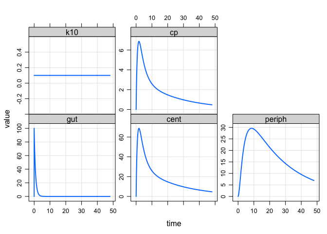

<!-- README.md is generated from README.Rmd. Please edit that file -->

# mread.yaml

<!-- badges: start -->

<!-- badges: end -->

**The package name will probably change with time**. For now,
experimenting with alternate methods for model specification. I’m trying
to leverage existing markup languages (i.e. yaml) to standardize input a
bit and make writing the model more powerful and intuitive.

There is a 100% yaml model specification format in the works. For now,
trying to refine specification of ODE models as a series of reactions.

## Installation

``` r
# install.packages("devtools")
devtools::install_github("kylebaron/mread.yaml")
```

## Example

### Setup

``` r
library(mread.yaml)
library(dplyr)
library(mrgsolve)
```

Read some input
code

``` r
examp <- system.file("examples", "two_cmt_model.cpp", package = "mread.yaml")
```

We are focusing on this **new model specification block**:

``` r
[ reactions ]
 
- label: absorption from dosing compartment
  species: gut --> cent
  form: ka * gut
- label: elimination from central compartment
  species: cent --> NULL
  form: cl * conc
- label: distribution to peripheral compartment
  species: cent <--> periph
  form: k12 * cent - k21 * periph
```

In the `[ reactions ]` block of this simple model we, write the model in
reaction / arrow notation as a series of fluxes:

  - absorption from the gut to the central compartment (1)
  - elimination (2)
  - transfer between the central and peripheral compartments (3)

The remaining parts of the model specification file look similar to what
we usually see:

``` yaml
[ prob ]
This is a simple pk model; going to demonstrate how we can specify reactions
as fluxes and put them together as reactions.

[ cmt ] gut cent periph

[ param ] ka = 1.2, cl = 1, v1 = 10, v2 = 40, q = 5

[ main ]
double k10 = cl/v1;
double k12 = q/v2;
double k21 = q/v2;

[ ode_assignments ]
double conc = cent/v1;

[ reactions ]
- label: absorption from dosing compartment
  species: gut --> cent
  form: ka * gut
- label: elimination from central compartment
  species: cent --> NULL
  form: cl * conc
- label: distribution to peripheral compartment
  species: cent <--> periph
  form: k12 * cent - k21 * periph

[ table ] capture cp = cent/v1;

[capture] k10
```

mread.yaml provides a function to read and parse this type of model
specification file and return a model object just like
`mrgsolve::mread()`.

``` r
mod <- mread_rxn(examp, delta = 0.1, end = 48)
```

Once the model is loaded, it functions just like you had written it
using ODEs

``` r
mod
. 
. 
. ------------  source: two_cmt_model.cpp  ------------
. 
.   project: /private/var/fol.../T/RtmpajOFlt
.   shared object: two_cmt_model.cpp-so-a5124f1d0622 
. 
.   time:          start: 0 end: 48 delta: 0.1
.                  add: <none>
. 
.   compartments:  gut cent periph [3]
.   parameters:    ka cl v1 v2 q [5]
.   captures:      k10 cp [2]
.   omega:         0x0 
.   sigma:         0x0 
. 
.   solver:        atol: 1e-08 rtol: 1e-08 maxsteps: 20k
. ------------------------------------------------------
```

``` r
mrgsim(mod, ev(amt = 100)) %>% plot
```



In fact, all `mread_rxn()` does, is parse the reactions and write that
math as ODEs, creating this `.cpp` file that gets handled but regular
old `mread()`

``` c
[ PROB ]
This is a simple pk model; going to demonstrate how we can specify reactions
as fluxes and put them together as reactions.
 
[ CMT ]
gut cent periph
 
[ PARAM ]
ka = 1.2, cl = 1, v1 = 10, v2 = 40, q = 5
 
[ MAIN ]
double k10 = cl/v1;
double k12 = q/v2;
double k21 = q/v2;
 
[ TABLE ]
capture cp = cent/v1;
 
[ CAPTURE ]
k10
 
[ ODE ]
double conc = cent/v1;

double J01 = ka * gut;
double J02 = cl * conc;
double J03 = k12 * cent - k21 * periph;
 
dxdt_gut    = -J01;
dxdt_cent   =  J01 -J02 -J03;
dxdt_periph =  J03;

//-------------------------------

 
```
